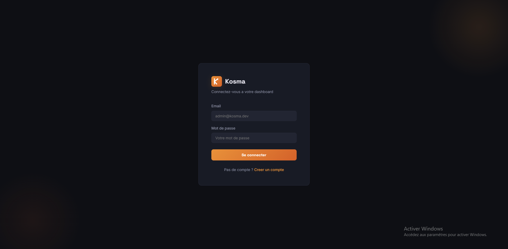
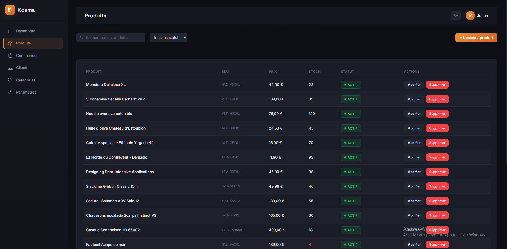
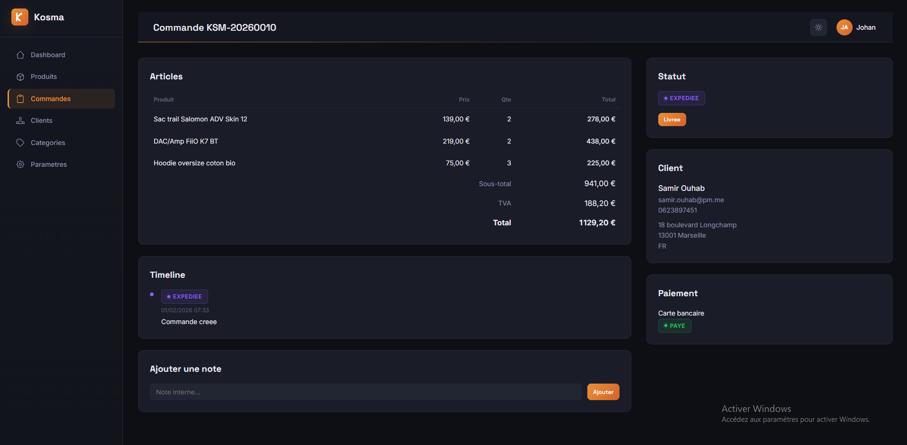

# Kosma Dashboard

**Tableau de bord e-commerce full-stack avec authentification JWT, gestion de produits, commandes et clients.**

Full-stack React + Node.js + MongoDB admin dashboard with JWT authentication, role-based access control, and comprehensive security features.


### Demo live

| Service | URL |
|---------|-----|
| **Application** | [kosma-dashboard.vercel.app](https://kosma-dashboard.vercel.app) |
| **API REST** | [kosma-dashboard-production.up.railway.app](https://kosma-dashboard-production.up.railway.app/health) |
| **Documentation API** | [Swagger UI](https://kosma-dashboard-production.up.railway.app/api-docs) |

> Projet de demonstration full-stack deploye sur Vercel (frontend) et Railway (API + MongoDB). Donnees fictives generees par le script de seed.

---

## Apercu

| Login | Dashboard |
|:---:|:---:|
|  |  |

| Produits | Detail commande |
|:---:|:---:|
|  |  |

---

## Fonctionnalites

### Frontend (React 18)
- Dashboard avec graphiques interactifs (Recharts)
- Gestion complete des produits (CRUD, images, export CSV)
- Suivi des commandes avec timeline de statut
- Liste clients avec historique d'achats
- Gestion des categories (arborescence parent/enfant)
- Theme sombre/clair avec toggle
- Design responsive
- Formulaires avec validation
- Composants reutilisables (Table, Pagination, SearchBar, Modal, StatusBadge)

### Backend (Node.js + Express)
- API REST versionnee (`/api/v1/`) avec documentation Swagger/OpenAPI
- Authentification JWT (access token 15 min + refresh token 7 jours)
- Controle d'acces base sur les roles (RBAC) : admin, manager, viewer
- Pagination, tri, recherche full-text, filtres avances
- Upload d'images (Multer) avec validation MIME
- Journal d'audit complet (qui a fait quoi, quand)
- Export CSV des produits

### Securite (OWASP)
- Helmet avec Content Security Policy strict
- Protection brute-force (verrouillage apres 5 tentatives)
- Rate limiting adaptatif (API globale + auth strict)
- Sanitization NoSQL (express-mongo-sanitize)
- Protection HPP (HTTP Parameter Pollution)
- Refresh token rotation avec revocation
- Limitation de taille des requetes (10 Ko)
- Noms de fichiers aleatoires (crypto.randomBytes)
- TTL automatique sur les tokens et logs d'audit

### DevOps & Deploiement
- **Production** : Vercel (frontend) + Railway (API + MongoDB)
- Docker & Docker Compose (API + MongoDB + Client Nginx)
- CI/CD GitHub Actions (lint, tests, audit securite)
- Tests unitaires + integration (Jest + Supertest)
- Tests composants React (Vitest + React Testing Library)
- Tests E2E (Cypress)
- ESLint 9 + Prettier

---

## Demarrage rapide

### Prerequis
- Node.js >= 18.0.0
- MongoDB 7+ (ou Docker)

### Avec Docker (recommande)

```bash
git clone https://github.com/Johan-Agouni/kosma-dashboard.git
cd kosma-dashboard
docker-compose up -d
```

Puis seeder la base :
```bash
cd server
npm install
npm run seed
```

- Client : http://localhost:3000
- API : http://localhost:5000
- Swagger : http://localhost:5000/api-docs

### Installation manuelle

**Backend :**
```bash
cd server
cp .env.example .env
npm install
npm run seed
npm run dev
```

**Frontend :**
```bash
cd client
cp .env.example .env
npm install
npm run dev
```

---

## Comptes de demonstration

| Role | Email | Mot de passe |
|------|-------|-------------|
| Admin | admin@kosma.dev | Admin123! |
| Manager | manager@kosma.dev | Manager123! |
| Viewer | viewer@kosma.dev | Viewer123! |

---

## Documentation API

Documentation interactive Swagger disponible a : [https://kosma-dashboard-production.up.railway.app/api-docs](https://kosma-dashboard-production.up.railway.app/api-docs) (ou `http://localhost:5000/api-docs` en local)

### Endpoints principaux

| Methode | Endpoint | Description | Acces |
|---------|----------|-------------|-------|
| POST | `/api/v1/auth/register` | Inscription | Public |
| POST | `/api/v1/auth/login` | Connexion | Public |
| POST | `/api/v1/auth/refresh` | Rafraichir le token | Public |
| GET | `/api/v1/dashboard/stats` | Statistiques generales | Authentifie |
| GET | `/api/v1/products` | Liste des produits | Authentifie |
| POST | `/api/v1/products` | Creer un produit | Admin, Manager |
| GET | `/api/v1/orders` | Liste des commandes | Authentifie |
| PUT | `/api/v1/orders/:id/status` | Changer le statut | Admin, Manager |
| GET | `/api/v1/customers` | Liste des clients | Authentifie |
| GET | `/api/v1/categories` | Liste des categories | Authentifie |
| GET | `/api/v1/settings/audit-log` | Journal d'audit | Admin |

---

## Structure du projet

```
kosma-dashboard/
├── .github/workflows/          # CI/CD GitHub Actions
├── client/                     # Frontend React (Vite)
│   ├── src/
│   │   ├── api/                # Couche API (Axios)
│   │   ├── components/         # Composants React
│   │   │   ├── auth/           # ProtectedRoute
│   │   │   ├── charts/         # StatsCard, graphiques
│   │   │   ├── common/         # Button, Modal, Pagination, SearchBar, StatusBadge
│   │   │   └── layout/         # Sidebar, Header, DashboardLayout
│   │   ├── context/            # AuthContext, ThemeContext
│   │   ├── hooks/              # useAuth, useFetch, useDebounce
│   │   ├── pages/              # 10 pages
│   │   ├── styles/             # CSS Modules + variables
│   │   └── utils/              # Formatters, constants
│   ├── cypress/                # Tests E2E
│   └── __tests__/              # Tests unitaires React
├── server/                     # Backend Express
│   ├── src/
│   │   ├── config/             # database, env, swagger
│   │   ├── controllers/        # 7 controllers
│   │   ├── middleware/         # auth, rbac, validate, upload, auditLog, errorHandler
│   │   ├── models/             # 6 modeles Mongoose
│   │   ├── routes/             # 7 fichiers de routes
│   │   ├── security/          # headers, rateLimiting, sanitize, bruteForce
│   │   ├── services/          # authService
│   │   ├── utils/             # logger, ApiError, asyncHandler, pagination
│   │   └── validators/        # Validateurs express-validator
│   ├── seed/                  # Script de seed + donnees JSON
│   └── tests/                 # Tests unitaires + integration
├── docker-compose.yml         # 3 services (API + MongoDB + Client)
├── Dockerfile.server          # Multi-stage Node.js Alpine
├── Dockerfile.client          # Multi-stage Vite + Nginx
├── SECURITY.md                # Documentation securite
└── README.md
```

---

## Stack technique

| Couche | Technologies |
|--------|-------------|
| **Frontend** | React 18, Vite, React Router v6, Recharts, React Hook Form, Axios, CSS Modules |
| **Backend** | Node.js 18, Express 4, Mongoose 8, JWT, Swagger/OpenAPI, Multer, Winston |
| **Base de donnees** | MongoDB 7 |
| **Securite** | Helmet, bcrypt, express-rate-limit, express-mongo-sanitize, hpp |
| **Tests** | Jest, Supertest, Vitest, React Testing Library, Cypress |
| **DevOps** | Docker, docker-compose, GitHub Actions, ESLint 9, Prettier |
| **Deploiement** | Vercel (frontend), Railway (API + MongoDB) |

---

## Tests

### Backend
```bash
cd server
npm test                    # Tests avec couverture
npm run test:watch          # Mode watch
```

### Frontend
```bash
cd client
npm test                    # Tests unitaires
npm run cypress:open        # Cypress en mode interactif
npm run cypress:run         # Cypress en mode headless
```

---

## Securite

Voir [SECURITY.md](./SECURITY.md) pour le detail complet des mesures de securite implementees.

---

## Licence

MIT - Voir [LICENSE](./LICENSE)

---

## Auteur

**Johan Agouni** - Developpeur Web Backend/Frontend

- GitHub : [@Johan-Agouni](https://github.com/Johan-Agouni)
- Disponible en freelance - Aix-en-Provence, France
